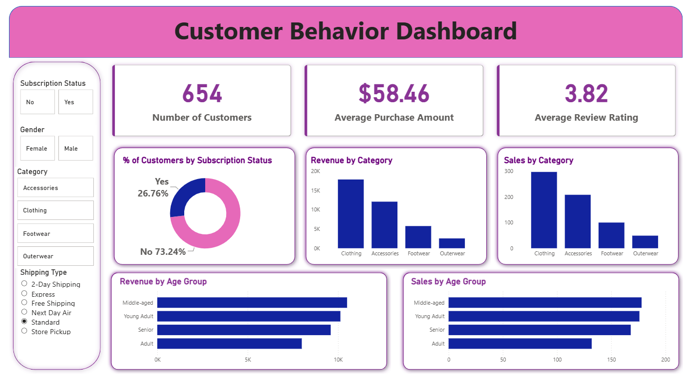

# 📊 Customer Behavior Analytics

  <strong>Turning retail customer data into actionable business insights</strong>

  

  <a href="./customer_behavior_dashboard.pbix">📊 Power BI Dashboard</a> •
  <a href="./Customer_Shopping_Behavior_Analysis.ipynb">🐍 Python Analysis</a> •
  <a href="./customer_behavior_sql_queries.sql">🗄️ SQL Analysis</a> •
  <a href="./customer_shopping_behavior.csv">📁 Dataset</a>

---

## 🚀 About

An end-to-end **retail customer analytics project** built with **Python, SQL, and Power BI** to understand customer behavior, spending patterns, product performance, and opportunities for customer retention.

### 🔄 Workflow

**Raw Data → Cleaning → EDA → SQL Analysis → Power BI → Insights**

---

## 🧰 Tech Stack

`Python` · `Pandas` · `Matplotlib` · `Seaborn` · `SQL` · `Power BI` · `Jupyter`

---

## 🔍 Analysis

| 👥 Customer Behavior | 🛍️ Product Performance | 📈 Business Insights    |
| -------------------- | ---------------------- | ----------------------- |
| Demographics         | Category performance   | High-value segments     |
| Segmentation         | Purchase patterns      | Spending trends         |
| Purchase frequency   | Customer preferences   | Retention opportunities |
| Loyalty behavior     | Product demand         | Marketing opportunities |

---

## 📊 Power BI Dashboard

The interactive dashboard brings the analysis together through:

**Customer Segmentation · Spending KPIs · Purchase Behavior · Product Performance · Demographics · Loyalty**

  <a href="./customer_behavior_dashboard.pbix">
    <strong>📥 Open the Power BI Dashboard</strong>
  </a>

---

## 📁 Project Resources

| Resource                                                             | Description                        |
| -------------------------------------------------------------------- | ---------------------------------- |
| 🐍 [Python Notebook](./Customer_Shopping_Behavior_Analysis.ipynb)    | Data cleaning, EDA & preprocessing |
| 🗄️ [SQL Queries](./customer_behavior_sql_queries.sql)                | Business-focused SQL analysis      |
| 📊 [Power BI Dashboard](./customer_behavior_dashboard.pbix)          | Interactive dashboard              |
| 📁 [Dataset](./customer_shopping_behavior.csv)                       | Customer shopping data             |
| 📋 [Business Problem](./Business%20Problem%20Document.pdf)           | Problem definition                 |
| 📄 [Project Report](./Customer%20Shopping%20Behavior%20Analysis.pdf) | Detailed analysis                  |
| 🎤 [Presentation](./Customer-Shopping-Behavior-Analysis.pptx)        | Project presentation               |

---

## 💡 Key Outcomes

- Identified **high-value customer segments**
- Analyzed **spending and purchasing patterns**
- Evaluated **product and category performance**
- Examined **purchase frequency and loyalty behavior**
- Derived opportunities for **targeted marketing and retention**

---

## 👨‍💻 Author

**AK**  
B.Tech student focused on **Software Development & Data Analytics**

[GitHub → A-verse](https://github.com/A-verse)

---

  ⭐ <strong>Star the repository if you found it useful.</strong>

